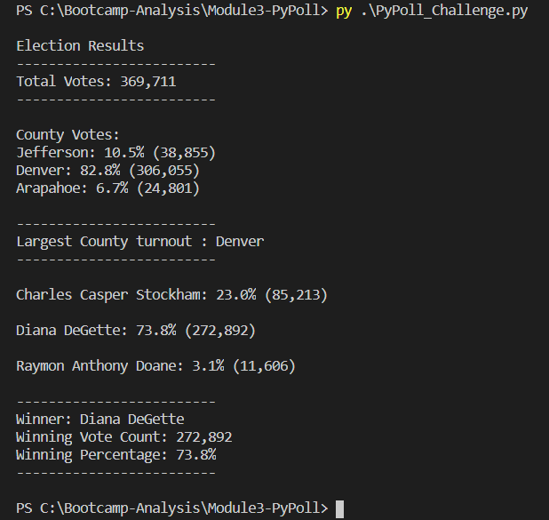

# Election Analysis

## Overview of Election Audit

A Colarado Board of Elections employee has requested below additional data to complete the election audit of a recent local congressional election.

* The voter turnout for each county
* The percentage of votes from each county out of the total count
* The county with the highest turnout

## Election-Data Analysis

The election results that is provided in the file **"election_results.csv"** is analyzed by traversing through each row in the file using the *"csv reader"*

### Total vote count

  Total vote count is calculated by counting each votes while looping through all the rows in the election list using the formula:
  
  ```  total_votes = total + 1  ```
  
### Candidate name

Candidate name is present in the third column, which is extracted using the index **2** from the row using the formula:

``` candidate_name = row[2] ```

These candidate names are stored in a list of candidate names *candidate_options*.

### County name

County name is present in the second column, which is extracted using the formula:

``` county_name = row[1] ```
 
These county names are stored in a list of county names *county_list*.

### Candidate votes and percentage turnout

- Candidate vote is calculated by incrementing the vote against the candidate whenever the candidate name is encountered.

   ``` candidate_votes[candidate_name] += 1 ```
   
- Percentage of total votes for the candidate is calulated using the formula :

  ``` vote_percentage = float(votes) / float(total_votes) * 100 ```

### County votes and percentage turnout

- County vote is calculated by incrementing the vote against the county whenever the county name is encountered.

  ``` county_votes[county_name] += 1 ```

- Percentage of total votes in the county is calulated using the formula :

  ``` vote_percentage = float(votes)/float(total_votes) * 100 ```

### Winner of the election

The winner of the election is determined by saving the *vote* and *vote_percentage* secured by the candidate while looping through the rows if the *vote* and *vote_percentage* is greater than the saved *winning_count* and *winning_percentage*.

The below formula is used to determine the same :
```
        if (votes > winning_count) and (vote_percentage > winning_percentage):
            winning_count = votes
            winning_candidate = candidate_name
            winning_percentage = vote_percentage
```

### County with largest turnout

The county with largest votes is determined by saving the *votes* and *vote_percentage* received in each county while looping through the rows if the *votes* and *vote_percentage* is greater than the saved *largest_county_voters*.

The below formula is used to determine the same :

```
            largest_county_voters = votes
            largest_voter_turnout = vote_percentage
            largest_county = county_name
```

## Election-Audit Results

The analysis of the election show that:
* **Total Votes** cast in the election : **"369,711"** 
* The **County Turnout** were:
  - Jefferson had **"10.5%"** of voter turnout and **"(38,885)"** number of votes
  - Denver had **"82.8%** of voter turnout and **"(306,055)"** number of votes
  - Arapahoe had **"6.7%"** of votes turnout and **"(24,801)"** number of votes 
* **Denver** had the largest number of votes with **"82.8%"** turnout
* The **Candidate Results** were:
  - Charles Casper Stockham received **"23.0%"** of the votes and **"(85,213)"** number of votes.
  - Diana DeGette received **"73.8%"** of the votes and **"(272,892)"** number of votes.
  - Raymon Anthony Doane received **"3.1%"** of the votes and **"(11,606)"** number of votes.  
* The **Winner** of the election was:
  - Candidate **Diana DeGette**, who received **"73.8%"** of the votes and **"(272,892)"** number of votes.
  
  Please find the output of the election audit :
  
  
  
  ## Election-Audit Summary
  
  The python script written to analyse the data can be extended to analyze all the election results with few modifications.
  
  Please find my business proposal on the changes that are needed to be able to analyze all other elections:
  * The script can be modified to provide the winner or the popular candidate in each county.
  * The script can be modified to provide the breakdown of the votes and percentage of votes received by candidates in each county.
  * The script can be used to analyze any election results by modifying it to make the election result input file readable from user prompt.
  * The script is capable of handling any number of candidates and county names without any further changes, not limited to the current list of three candidates and counties.

  
